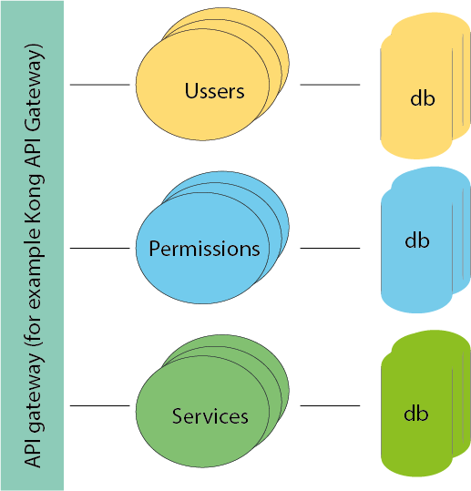
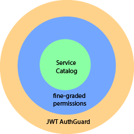

<h1 align="center">
  Service Catalog
</h1>

  <p align="center">A simple dockerized service catalog restful backend using <a href="https://nestjs.com/" target="_blank">NestJs</a>, <a href="https://typeorm.io/" target="_blank">TypeORM</a>, <a href="https://www.typescriptlang.org/" target="_blank">TypeScript</a></p>

## Features

- user management and JWT auth;
- service catalog CRUD function, supporting (filter, sorting, pagination);
- fine-grained permission/access control;
- healthcheck endpoint and OpenAPI swagger doc;

## Running the app

```bash
docker-compose up -d
```

## API endpoints
for more information, please check [catalog-api doc](http://localhost:3000/doc)

| Endpoint                                |     Description       | 
| -------------                           |   :-------------:     | 
| http://localhost:3000/doc                   | api swagger doc           | 
| http://localhost:3000                   | healthcheck           | 
| http://localhost:3000/auth/signup       | user sign up          |  
| http://localhost:3000/auth/signin       | user sign in          |
| http://localhost:3000/service       | POST to add a service         |
| http://localhost:3000/service/:id     | GET a service        |
| http://localhost:3000/service/:id     | DELETE a service        |
| http://localhost:3000/service/:id     | UPDATE a service        |
| http://localhost:3000/service/     | GET a list of services, supporting basic pagination        |
| http://localhost:3000/service/search     | search a list of services, supporting filtering, sorting, pagination        |
| http://localhost:3000/permission/grant     | grant a user to access a service        |
| http://localhost:3000/permission/remove     | remove a user from accessing a service        |
| http://localhost:3000/permission     | GET a list of services that allows to be accessed for the current user        |
| http://localhost:3000/permission/:id    | GET a list of services that allows to be accessed for the given user        |

## Design
The service catalog api was designed for small- and medium-sized enterprises. 
### Function design
It contains 3 major features/functions: 
- auth: user management
- permission: fine-graded permission management
- service: service catalog management

### Architectural design
Constricted by time, all the above 3 functions are built into one application and dockerized together with postgres database.

### Another possible architectural design for large enterprises
For large enterprises, the above 3 features/functions can be optionally separated into 3 applications with their own persistent layers. 



## Authentication/Authorization



For the service catalog endpoints, there few layers of access control:
- all the endpoint requires JWT auth;
- admin users have the full access to the all the services;
- for normal users, the fine-graded permission ([the permission endpoint](http://localhost:3000/permission)) plays a role here. 

  1. all the users can have the full access to the services added by themselves; 
  2. services created a different users can only be accessed after the permission being granted by admin users; 
  3. When retrieving a list of services, only permitted services are exposed. 
  4. The fine-graded permission is implemented by NestJS interceptors;

## Additional considerations
- This is a weekend POC project and the author has never been previously exposed to NestJS. Reading NextJS documentation and coding happened within a very short period and there are tons of points to be improved for production purpose;
- The project needs more tests (need more time) and ideally, a pipeline should be included/setup for CI/CD;

